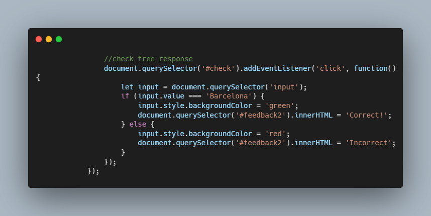

# Trivia - CS50

### Description

Webpage that allows users to answer trivia questions.
Multiple choice trivia questions using HTML
Then including Javascript logic to change colors of buttons when user clicks on them.
Using logic to change color when user confirm answer.

### How to use

Run http-server from your terminal

### Code Snippet

### Links

For more information about Filter-more visit: 

---------------------------------
[cs50 course](https://cs50.harvard.edu/x/2022/labs/8/)
---------------------------------------------------------------

